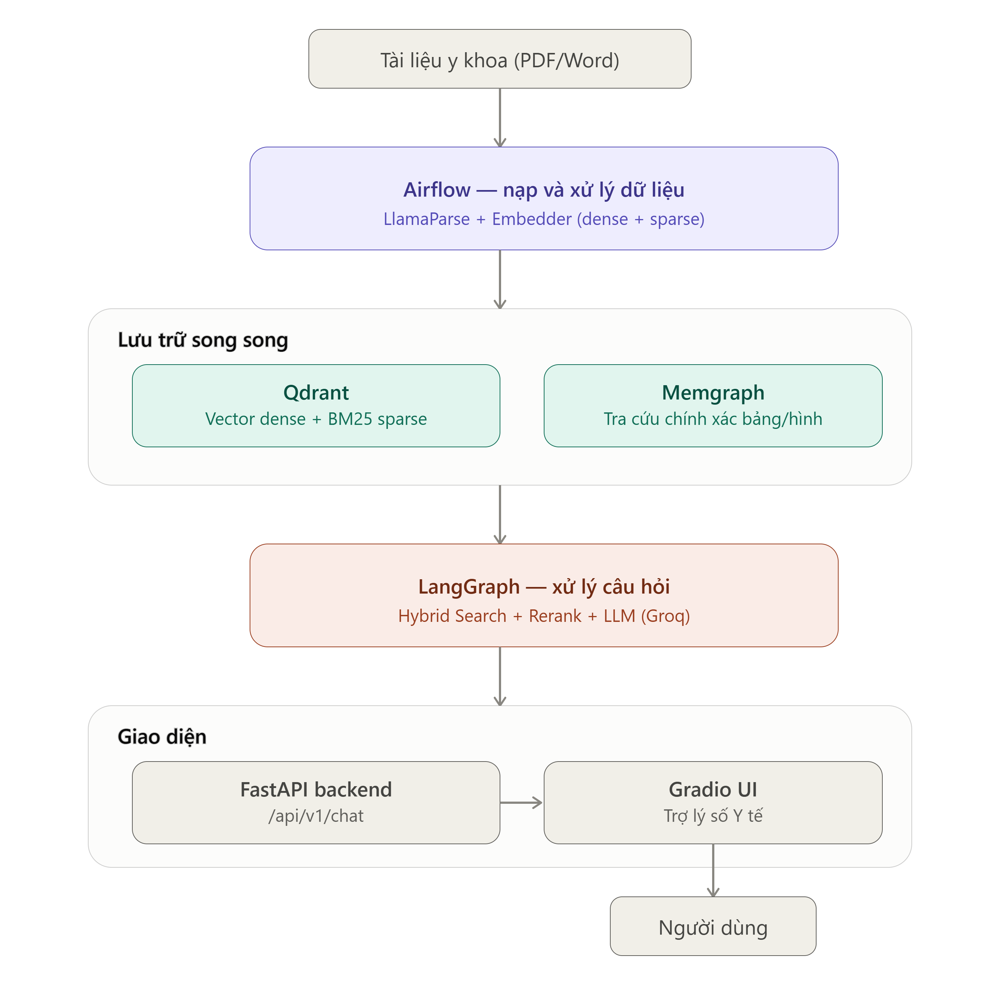

# Medical RAG Chatbot

## Giới thiệu
Medical RAG Chatbot là một hệ thống hỏi đáp y tế tự động áp dụng phương pháp Retrieval-Augmented Generation (RAG). Dự án kết hợp cơ sở dữ liệu vector (Qdrant) và cơ sở dữ liệu đồ thị (Memgraph) để tra cứu thông tin y tế một cách chính xác. Ngoài ra, dự án sử dụng Apache Airflow để điều phối và quản lý các luồng xử lý dữ liệu.

### Kiến trúc tổng quan


*Lưu ý: Qdrant DB và Memgraph được cấu hình chạy hoàn toàn ở môi trường local bên trong Docker, nên bạn không cần phải cung cấp API Key cho hai dịch vụ này.*

## Cấu trúc thư mục
```
medical_rag_project/
├── benchmark/        # Chứa kịch bản đánh giá hiệu suất mô hình và kết quả báo cáo
├── dags/             # Chứa luồng công việc (DAGs) của Apache Airflow để nạp và xử lý dữ liệu
├── data/             # Lưu trữ tài liệu y khoa đầu vào (PDF/Word) và các tệp kết quả
├── src/              # Thư mục chứa mã nguồn chính của toàn bộ hệ thống
│   ├── api/          # Các endpoint FastAPI xử lý yêu cầu phía backend
│   ├── core/         # Logic cốt lõi (LangGraph workflow, Embedding, Qdrant/Memgraph, LlamaParse)
│   ├── ui/           # Mã nguồn giao diện người dùng (Gradio UI)
│   ├── config.py     # Nạp và quản lý các biến môi trường cấu hình hệ thống
│   └── database.py   # Module khởi tạo và quản lý kết nối cơ sở dữ liệu
├── .env.sample       # File mẫu chứa các biến cấu hình dự án để người dùng tham khảo
├── docker-compose.yml# File cấu hình triển khai toàn bộ hệ thống bằng Docker
├── Dockerfile        # File build image Docker cho các dịch vụ
├── requirements.txt  # Danh sách tất cả thư viện Python cần cài đặt
├── run_backend.py    # Script khởi chạy API Backend (chạy trên port 8000)
└── run_frontend.py   # Script khởi chạy giao diện Chatbot UI (chạy trên port 7860)
```

### Chi tiết thư mục `data/`
Thư mục `data/` là nơi lưu trữ tài liệu gốc và lịch sử nạp dữ liệu (ingestion) của hệ thống:
- **`uploads/`**: Nơi chứa các sách, phác đồ y khoa (PDF/Word/TXT) chờ xử lý. Bạn cần chép tài liệu mới muốn nạp vào thư mục này.
- **`processed/`**: Nơi lưu trữ các tài liệu đã nạp xong. Sau khi Airflow xử lý xong tài liệu ở thư mục `uploads/`, tài liệu sẽ được tự động di chuyển sang đây.
- **`.llamaparse_cache/`**: Thư mục bộ nhớ đệm (cache) lưu tạm kết quả trích xuất từ LlamaParse để tối ưu tốc độ và chi phí gọi API.
- **`.ingest_cache.json`**: File ghi nhận danh sách tài liệu đã được vector hóa (embedding) thành công để tránh nạp trùng lặp.
- **Các file `manifest_*.json`**: "Biên bản" nạp dữ liệu tự động sinh ra bởi Apache Airflow, theo dõi lịch sử và trạng thái của các đợt nạp tài liệu tự động (`scheduled`) hoặc thủ công (`manual`).

### Chi tiết thư mục `benchmark/`
Thư mục này chứa các kịch bản đánh giá (benchmark) hiệu suất mô hình và kết quả báo cáo. Đáng chú ý là 3 bộ dữ liệu câu hỏi (dataset) chuẩn y khoa được đưa vào để kiểm thử:
- **`ESC_Hypertension_Guidelines_2024_100_(2).json`**: Bộ 100 câu hỏi đánh giá dựa trên Phác đồ điều trị Tăng huyết áp của Hiệp hội Tim mạch Châu Âu (ESC) năm 2024.
- **`Hướng_dẫn_Tăng_HA_BYT_2023_89_(2).json`**: Bộ 89 câu hỏi đánh giá dựa trên Hướng dẫn chẩn đoán và điều trị Tăng huyết áp của Bộ Y tế Việt Nam ban hành năm 2023.
- **`VNHA_Điều_trị_Tăng_Huyết_Áp_2024_90(2).json`**: Bộ 90 câu hỏi đánh giá dựa trên Hướng dẫn chẩn đoán và điều trị Tăng huyết áp của Phân hội Tăng huyết áp Việt Nam (VNHA) năm 2024.

## Hướng dẫn cài đặt và sử dụng (bằng Docker)

Dự án này được đóng gói hoàn toàn bằng Docker, giúp việc triển khai trở nên đồng bộ và dễ dàng.

### 1. Yêu cầu hệ thống
- Đã cài đặt **Docker** và **Docker Compose**.

### 2. Thiết lập biến môi trường (.env)
Dự án yêu cầu một số API Key để hoạt động. Bạn hãy copy file `.env.sample` đổi tên thành `.env` và điền các khóa bảo mật sau:
- **HF_TOKEN (Hugging Face Token):** Đăng nhập vào [Hugging Face](https://huggingface.co/), truy cập mục *Settings > Access Tokens* và tạo một token mới (quyền Read).
- **GROQ_API_KEY:** Tạo khóa API tại [Groq Console](https://console.groq.com/keys).
- **LLAMA_CLOUD_API_KEY:** Tạo khóa API tại [LlamaCloud](https://cloud.llamaindex.ai/).

*(Qdrant DB và Memgraph đã được cấu hình chạy nội bộ trong Docker nên không cần thiết lập API Key)*

### 3. Khởi chạy hệ thống
Mở terminal tại thư mục gốc của dự án (`medical_rag_project`) và chạy lệnh sau để tải, build và khởi động toàn bộ các dịch vụ:

```bash
docker-compose up -d --build
```

Sau khi quá trình khởi động hoàn tất, bạn có thể truy cập các dịch vụ qua các đường dẫn sau:
- **Frontend (Giao diện Chatbot):** [http://localhost:7860](http://localhost:7860)
- **Backend (API):** [http://localhost:8000](http://localhost:8000)
- **Airflow Webserver:** [http://localhost:8080](http://localhost:8080) *(Tài khoản mặc định: admin / admin)*
- **Qdrant (Vector DB):** `localhost:6333`
- **Memgraph-lab:** [http://localhost:3000](http://localhost:3000)

### 4. Theo dõi log và kiểm tra
Để xem log của các dịch vụ đang chạy ngầm, sử dụng lệnh:
```bash
docker-compose logs -f
```

### 5. Dừng hệ thống
Để dừng và tắt toàn bộ các container của hệ thống, chạy lệnh sau:
```bash
docker-compose down
```

## Hướng dẫn thao tác thường gặp

### 1. Nạp tài liệu y khoa (Ingest PDF/Word)
Để hệ thống học thêm kiến thức mới, bạn chỉ cần copy file tài liệu (PDF, Word/TXT) dán vào thư mục **`data/uploads/`**. Apache Airflow sẽ tự động quét và chạy luồng nạp dữ liệu (DAG) theo lịch đã thiết lập. Khi xử lý thành công, file tài liệu sẽ tự động được di chuyển sang thư mục **`data/processed/`**. Bạn cũng có thể vào giao diện Airflow Webserver (`http://localhost:8080`) để bấm chạy luồng (Trigger DAG) để nạp ngay lập tức.

### 2. Nạp lại một file đã từng nạp (Re-ingest)
Hệ thống sử dụng cơ chế lưu vết để tránh xử lý trùng lặp. Nếu bạn muốn hệ thống nạp lại một file cũ đã từng xử lý:
- Hãy xóa file **`data/.ingest_cache.json`**. Lần chạy DAG tiếp theo, hệ thống sẽ tiến hành nạp lại file đó.
- **Lưu ý về LlamaParse Cache:** Quá trình bóc tách hình ảnh/bảng biểu bằng LlamaParse có bộ nhớ đệm riêng nằm ở thư mục **`data/.llamaparse_cache/`**. Nếu bạn chỉ xóa `.ingest_cache.json` mà **không xóa** `.llamaparse_cache`, hệ thống sẽ nạp lại file nhưng dùng lại kết quả bóc tách cũ (giúp bạn tiết kiệm thời gian và chi phí API). Nếu bạn thực sự muốn bóc tách lại từ con số không, hãy xóa cả dữ liệu trong thư mục `.llamaparse_cache/`.

### 3. Cập nhật code và khởi động lại Docker nhanh
Mã nguồn trong thư mục `src/` đã được ánh xạ (mount volume) trực tiếp vào trong Docker. 
- Nếu bạn chỉ sửa logic code Python thông thường, bạn có thể khởi động lại nhanh dịch vụ tương ứng để nhận code mới bằng lệnh:
  ```bash
  docker-compose restart backend      # Nếu sửa code backend
  docker-compose restart frontend     # Nếu sửa code frontend
  docker-compose restart airflow-scheduler airflow-webserver  # Nếu sửa DAGs của Airflow
  ```
- Nếu bạn có cài thêm thư viện mới vào `requirements.txt` hoặc thay đổi cấu trúc `Dockerfile`, bạn bắt buộc phải build lại image bằng lệnh:
  ```bash
  docker-compose up -d --build
  ```

---
**Ghi chú quan trọng:** Ngừng hỗ trợ Llama 3.1 8B Instant và sẽ loại bỏ nó vào ngày 16 tháng 8 năm 2026. Sau ngày loại bỏ, các yêu cầu đến mô hình này sẽ không còn được xử lý nữa. 

Khuyến khích bạn chuyển đổi khối lượng công việc của mình sang mô hình thay thế được đề xuất của chúng tôi, GPT OSS 20B.
